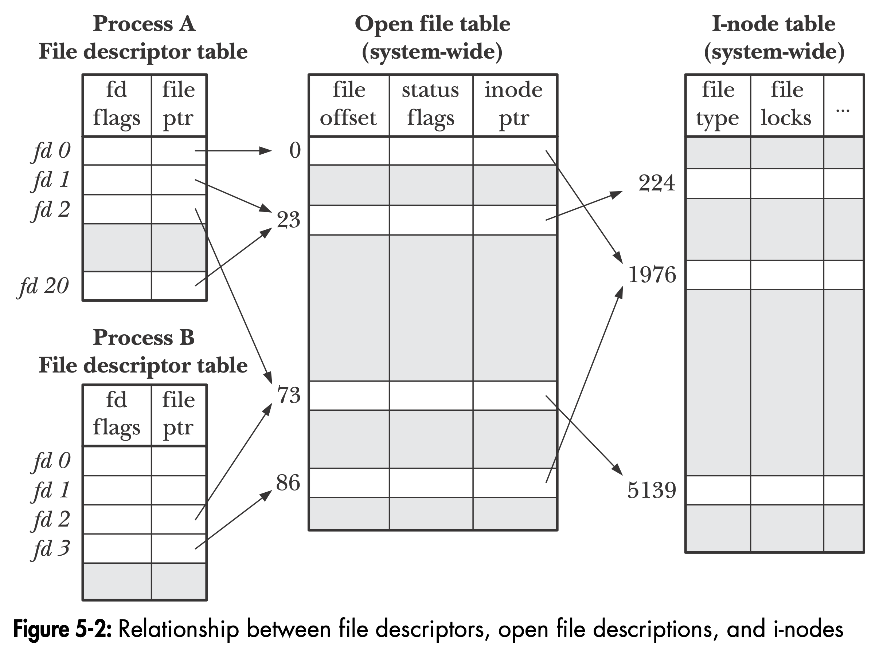

# Learn about I/O polling in Linux and what makes node.js scale well

## Goal 🏁

1. Learn how `epoll` works. Educate myself on `epoll`, `poll`, `select` and related concepts.

2. Create a minimalistic application which serves as an example of how Linux `epoll` can be used. A
   good example would be a simple TCP sever using `socket(2)`. Server _waits_ until there is some
   data to be read and then writes a response. It should be a similar application to the one
   presented by Sam Roberts (see _#Sources_).

## Why should you care?

I work a lot with node.js. Chances are that you work with node too, or at least used to work with
it. As you may know, under the hood node uses [libuv](https://github.com/libuv/libuv) to manage it's
asynchronous I/O operations. On the libuv homepage, we may find the list of libuv's key features.
One of them is:

> Full-featured event loop backed by epoll, kqueue, IOCP, event ports.

OK... so there is something like `epoll`, but what the heck is `kqueue` or `IOCP`???

> libuv is a multi-platform support library with a focus on asynchronous I/O.

**libuv supports many platforms.** `epoll` itself is a Linux-only feature. BSD uses `kqueue` and
Windows IOCP.

**So if you want to understand how node.js works internally and you are a Linux user, you need to
learn about `epoll`.**

## So what is epoll?

It's difficult to understand how the `epoll` works without first getting a good grasp on the idea of
_file descriptors_.

A good way to begin the adventure with epoll is to simply read the docs. Manpage for `epoll`
provides a lot of insight. (Yeah, I know. Obvious. Yet still it surprises people 🤷‍♂️)

We can find there that `epoll` can monitor multiple file descriptors to see if I/O operations are
possible on any of them. Reading further we find that:

> The epoll API can be used either as an **edge-triggered** or a **level-triggered** interface and
> scales well to large numbers of watched file descriptors.

Ok. So from the programmer perspective, `epoll` can work in two ways: **edge-triggered** or a
**level-triggered** interface. This will become important later on. We also get information that it
scales well. Spoiler alert ⚠️ - when it comes to monitoring large number of file descriptors,
`epoll` will perform much better than `poll(2)` or `select(2)`.

## API

To use `epoll` remember to include the `<sys/epoll.h>` header.

#### `epoll_create` and `epoll_create1`

There are two functions that can "create" a new epoll instance. Or as the manual says _"open an
epoll file descriptor"_. When `epoll_create` or `epoll_create1` is called, the kernel will create a
new instance of epoll - a special data structure inside the kernel.

The file descriptor to an epoll instance can be used to add, remove, or modify file descriptors that
we want to monitor for I/O.

Since Linux 2.6.8 the `size` argument passed to `epoll_create` is ignored and the underlying data
structure dynamically resizes. However, `size` has to be greater than 0. That is for backward
compatibility reasons. See `epoll_create(2)` for more details.

```C
int epoll_create(int size);
int epoll_create1(int flags);
```

What is the difference between the two? `epoll_create1` allows you to pass the `EPOLL_CLOEXEC`
(close on exec) flag. This basically means that when `fork(2)` will be called, the child process
will close the epoll file descriptor before it `exec(2)` is called.

On error, `epoll_create` will return -1. Manpage `epoll_create(2)` enumerates all possible errno
values. I'll mention only one - `EMFILE`. It means that we've hit the _per-user_ limit of epoll
instances. You can check the value of that limit with

```
cat /proc/sys/fs/epoll/max_user_watches
```

#### `epoll_ctl`

```C
int epoll_ctl(int epfd, int op, int fd, struct epoll_event *event);
```

The first argument `epfd` is the file descriptor of the epoll instance created with `epoll_create`.

Then in `op` (_operation_) we have to set a flag which actually determines what we're trying to do.
We can add, delete, or modify file descriptors on epoll's list of interest. Then we pass the actual
file descriptor `fd` that we want to "observe".

Finally we have to pass a pointer to an `epoll_event` structure. Following the man page we can see
that `epoll_event` structure looks like that:

```C
struct epoll_event {
    uint32_t events;          /* Epoll events */
    epoll_data_t data;        /* User data variable */
};

typedef union epoll_data {
    void        *ptr;
    int          fd;
    uint32_t     u32;
    uint64_t     u64;
} epoll_data_t;
```

The `events` is yet another time a mask which defines in what sort of events are we interested.

#### `epoll_wait`

```C
int epoll_wait(int epfd, struct epoll_event *events, int maxevents, int timeout);
```

Here, again we have to pass the file descriptor of the epoll instance. The second argument is an
array of instances of the `epoll_event` structures. This is where the events available for the
caller will be stored. The `maxevents` specifies the max number of events stored in `*events`. You
can think of `*events` and `maxevents` as of an array and its length.

The `timeout` is the number of milliseconds that `epoll_wait` will block. If `timeout` is set to -1,
`epoll_wait` waits indefinitely. In case of `timeout` being set to 0, `epoll_wait` will return
mediately even if there aren't any events available.

It is worth to point out that the `data` field of the `epoll_event` will have the same data that was
set with `epoll_ctl`.

In case of success `epoll_wait` will return the number of file descriptors ready for requested I/O
operation. (👉 Remember that in `epoll_event` we had to specify what typo of I/O are we interested
in.) In case of an error the value of -1 is returned.

## Things to 🐻 in 🧠

There are a few tricky things about `epoll`.

## Mind the difference between a file descriptor and file description

This is where good understanding of the concept of a _file descriptor_ comes in handy.

### A few words on file descriptors

When we think about file descriptors we usually think about some abstract handle that we use to
access a file (or a pipe, socket, etc.). And this already is a good intuition. It is something
_abstract_. Physically its a non-negative integer, generally represented as `int` type. Usually when
created (eg. by a `open(2)` syscall) it will be the lowest (lowest number) file descriptor not
currently open for the process.

When a `open(2)` is called a file descriptor is returned but underneath a new **file description**
is created. **File description** is a system-wide table of open files, sometimes referred to as
_file table_. The file description keeps information of the file status _flags_, access mode (e.g.
write-only, read-only, read-write), the opened file's, reference to _inode_ for that file. _offset_.
Quoting the Linux manual: **A file descriptor is a reference to an open file description.**

This is very important for a few reasons. For instance, when file's path is removed or changed (e.g.
to refer to a different file) it does not affect the _file descriptor_ - _file description_
reference.

Keep in mind that many file descriptors can point to a single file description. This is for instance
when a file descriptor is duplicated using a `dup(2)` syscall. The duplicated file descriptor refers
to the same open file description. As a consequence, both file descriptors will share the file's
offset and status flags. The same behavior can be observed between two processes. A child process
created with `fork(2)` will inherit duplicates of the parent's file descriptors. **This means that
child's file descriptors will refer to the same file descriptions as patent's file descriptors.**
This is why sometimes we want to mark our file descriptors with `O_CLOEXEC` flag, so that file
descriptors are closed once a forked process execs.

Note that each time we call `open(2)` a new file description is created. **This means that there can
be many file descriptions pointing to the same inode.**

_Figure from "The Linux Programming Interface" by Michael Kerrisk_: 

👉 On Linux you cat see open file descriptors of a process in `/proc/[pid]/fd`. In
`/proc/[pid]/fdinfo` you can find the value of _offset_, _flags_ (status flags), and _mnt_id_ (mount
point).

**When is a file descriptor closed?**

- When `close(2)` is called
- When process exits
- After `exec(2)` when the descriptor is marked with `O_CLOEXEC` (close on exec)

🔥 Now time for the bombshell - **`epoll` does not track the per-process file descriptors. Instead
it tracks the underlying file description**. This has a important consequence which was described in
the `epoll(7)` manpage as follows:

> Will closing a file descriptor cause it to be removed from all epoll sets automatically?
>
> Yes, but be aware of the following point. A file descriptor is a reference to an open file
> description (see `open(2)`). Whenever a file descriptor is duplicated via `dup(2)`, `dup2(2)`,
> `fcntl(2)` > `F_DUPFD`, or `fork(2)`, a new file descriptor referring to the same open file
> description is created. An open file description continues to exist until all file descriptors
> referring to it have been closed. A file descriptor is removed from an epoll set only after all
> the file descriptors referring to the underlying open file description have been closed (or before
> if the file descriptor is explicitly removed using `epoll_ctl(2)` `EPOLL_CTL_DEL`). This means
> that even after a file descriptor that is part of an epoll set has been closed, events may be
> reported for that file descriptor if other file descriptors referring to the same underlying file
> description remain open.

To summarize this part, we can conclude that **a process will continue to receive events via
`epoll_wait` for a file descriptor that might have been closed, as long as there the file
description which it has been referencing is still referenced by at least one file descriptor**.

### Non-Blocking file descriptors

When reading (or any other I/O operation) on a file descriptor when there is no data will block. A
file descriptor can be put in a non-blocking mode. This way any I/O operations on such file
descriptor will not cause the process to wait.

### Level-triggered and Edge-triggered

In a nutshell the difference can be boiled down to:

- Level-triggering - A file descriptor is considered _ready_ when it is possible to perform I/O
  operation without blocking
- Edge-triggering - We are notified when there was some I/O activity on a given file descriptor
  since it was last checked (e.g. there is some new data pending to be read).

With level-triggering we can always check for a file descriptors readiness, whereas with
edge-triggering there has to be a _"change"_ (_edge_). Because of that we can repeat the
level-triggered check calls many times. The reason might be that we do not want to read all the
available data at once but in smaller chunks. The edge-triggered notification model discourages us
from such approach. In fact, we might be encouraged to do "as much I/O as possible" whenever the
notification comes.

It easiest to see the difference on an example. Imagine that we're monitoring a socket file
descriptor. Some input data arrives on the socket. We call `epoll_wait`. Then we call `epoll_wait`
again. On the first call we will get the information that the socket file descriptor is ready
regardless of whether the level-triggering or edge-triggering was used. However, on the second call
only when level-triggering is used we are going to get the file descriptor "ready" notification.
With edge-triggering, the second call will block because there was no new input data on the socket.

This is also why edge-triggering is used with non-blocking file descriptors. In this approach,
whenever `epoll_waits` returns a list of "ready" file descriptors, each of them should be processed
by the appropriate I/O function until `EAGAIN` is returned. With edge-triggering approach we must
also prevent the so called **file descriptor starvation**.

Also, check the `epoll(7)` manpage. There is a **very good** use-case example which describes the
difference.

## Why is epoll better than poll or select?

**The computational complexity of poll and select is O(N), where N is the number of file descriptors
to be monitored.** Each time you call `poll(2)` or `select(2)` the kernel has to check every file
descriptor on the list. This is why we'd want to use `poll(2)` and `select(2)` only when the number
of file descriptors to monitor is small. Another slowdown for these two syscalls is that each time
they are called a data structure describing file descriptors to be monitored needs to be passed to
the kernel and then the kernel needs to return a modified version of that data structure. Then a
program calling `select(2)` or `poll(2)` needs to check which file descriptor is ready in the
structure returned by the kernel.

On the other hand, the complexity of epoll is O(M), where M is the number of events that have
occurred. When we create our "interest list" with `epoll_ctl`, we do it only once. The kernel
records that in a list associated with the underlying file description. Whenever there is some I/O
operation that makes the monitored file descriptor ready, the kernel will add an element to the
"ready" list for a given epoll file descriptor. Then whenever `epoll_wait` is called, it only gets
items from the "ready" list. By contrast to `select(2)` and `poll(2)`, epoll creates a data
structure in the kernel (in kernel space). Once such data structure is created, subsequent calls to
`epoll_wait` do not have to pass any information about monitored file descriptors to the kernel.
Also, kernel returns information only about file descriptors that are ready.

## Sources 📚

This repo is inspired by a number of other (much better) sources:

- Linux man pages 🐧
- "The Linux Programming Interface" by Michael Kerrisk
- [Example](https://gist.github.com/sam-github/71d0ebf53a63ab7ca35a1eccc8536e47) presented by Sam
  Roberts in [Node's Event Loop From the Inside Out](https://www.youtube.com/watch?v=P9csgxBgaZ8)
- Awesome articles on Medium by Cindy Sridharan -
  [Nonblocking I/O](https://medium.com/@copyconstruct/nonblocking-i-o-99948ad7c957) and
  [The method to epoll madness](https://medium.com/@copyconstruct/the-method-to-epolls-madness-d9d2d6378642)
